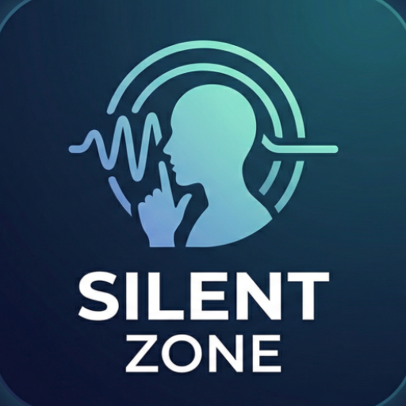
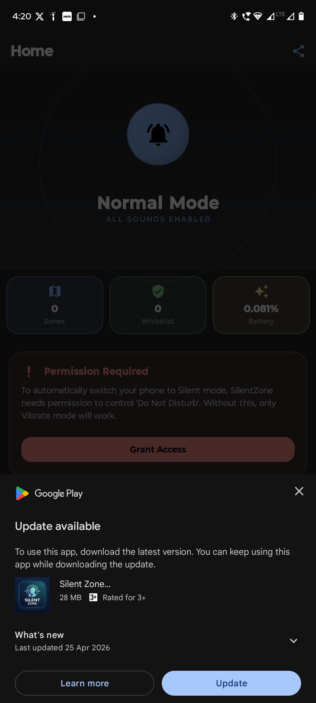

# SilentZone

<p align="center">
  
</p>

**SilentZone** is an intelligent, automated profile management application for Android. It seamlessly switches your device to Silent, Vibrate, or Normal mode based on your current Location (Geofencing) or connected Wi-Fi network. Say goodbye to manual interruptions during meetings, classes, or sleep.

[**Get it on Google Play**](#) *(Add Play Store Link Here)*

---

## 🌟 Core Features

- 📍 **Location-Based Zones (Geofencing)**: Select areas on an interactive map and set a radius. When you enter the zone, your phone automatically switches to your preferred ringer mode.
- 📶 **Wi-Fi-Based Zones**: Link specific Wi-Fi networks (e.g., Office, Home). Your profile adjusts instantly when your device connects to the network.
- ⭐️ **Important Contacts Bypass**: Never miss an emergency. Add vital contacts to a whitelist, allowing their calls to ring aloud even when your phone is in Silent Mode.
- 🔄 **Smart Restoration**: Once you leave a designated location or disconnect from a monitored Wi-Fi network, SilentZone intelligently restores your previous ringer state.
- 🔋 **Battery Efficient**: Built with Android's `WorkManager` and foreground location services to ensure reliable detection with minimal impact on battery life.

---

## 🛠️ Tech Stack & Architecture

This project is built using modern Android development practices and architecture guidelines (MVVM).

- **UI**: Jetpack Compose, Material 3
- **Language**: Kotlin
- **Architecture**: MVVM (Model-View-ViewModel), Repository Pattern
- **Dependency Injection**: Dagger Hilt
- **Local Storage**: Room Database
- **Background Processing**: WorkManager, Foreground Services, Broadcast Receivers
- **Mapping & Location**: Google Maps SDK, Google Play Services Location (Geofencing API)
- **Analytics & Crash Reporting**: Firebase Analytics, Firebase Crashlytics, Microsoft Clarity

---

## 🚀 Building the Project Locally

To clone and build this project on your local machine, follow these steps:

### Prerequisites
- **Android Studio** (Latest version recommended)
- **JDK 11** or higher
- A valid **Google Maps API Key**

### Setup Instructions

1. **Clone the repository:**
   ```bash
   git clone https://github.com/your-username/SilentZone.git
   cd SilentZone
   ```

2. **Configure API Keys:**
   Create a `local.properties` file in the root directory of the project (if it doesn't exist) and add your Google Maps API Key and Clarity Project ID:
   ```properties
   MAPS_API_KEY=your_google_maps_api_key_here
   CLARITY_PROJECT_ID=your_clarity_project_id_here
   ```

3. **Google Services (Firebase):**
   Ensure you have configured a Firebase project and placed your `google-services.json` file in the `app/` directory.

4. **Build and Run:**
   Sync the project with Gradle files and click "Run" in Android Studio to install it on your emulator or physical device.

---

## 📸 Screenshots

*(Add screenshots of your Dashboard, Map Selection, and Contacts screens here)*

| Dashboard | Map Selection | Important Contacts |
|:---:|:---:|:---:|
|  |  |  |

---

## 🔒 Permissions Used
SilentZone requires specific permissions to function correctly:
- **Do Not Disturb Access**: To modify the system's ringer mode.
- **Background Location**: To detect geofence transitions reliably when the app is closed.
- **Ignore Battery Optimizations**: To ensure the background services are not killed by the OS.
- **Read Contacts & Phone State**: To detect incoming calls and bypass silent mode for important contacts.

---

*Designed and developed to bring peace of mind.*
